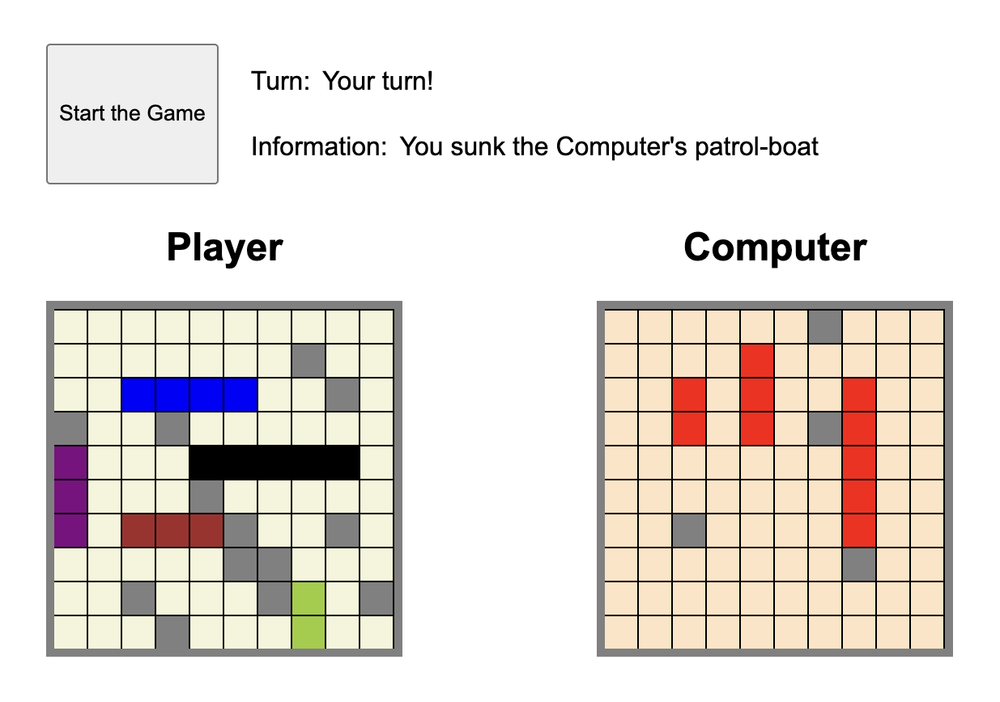

# Battleship Game

Battleship is a classic two-player board game [Wikipedia](<https://en.wikipedia.org/wiki/Battleship_(game)>) where each player has a 10x10 board.

## Introduction

This is a classic Battleship game implemented in `JavaScript`, `HTML`, and `CSS`. The game allows you to place your fleet of ships on a grid and take turns attacking your opponent's grid. The goal is to sink all of your opponent's ships before they sink yours.

### Game Rules

- **Battleship Placement:** Players place battleships on their board during the setup phase. Battleships must entirely fit within the board, and can be aligned either vertically or horizontally.
- **Taking Turns:** During gameplay, players take turns "attacking" a single position on their opponent's board. The opponent must respond with either a "hit" (if the attack hits a battleship) or a "miss."
- **Sinking Battleships:** A battleship is considered sunk if it has been hit on all the squares it occupies.
- **Victory Conditions:** The player wins the game when all of their opponent's battleships have been successfully sunk.



## Live Demo

[Battleship State Tracker](https://battleship-state-tracker-mo.netlify.app/)

## Features

- **Ship Placement:** Drag and drop your fleet of ships onto the grid.
- **Play Against the Computer:** Challenge the computer, which takes turns attacking your grid.
- **Orientation Toggle:** Easily change the ship placement orientation (horizontal/vertical).
- **Information Display:** Game messages are shown in the information display for an interactive experience.
- **Responsive Design:** The game features a user-friendly interface with a responsive design.

## How to Play

1. **Place Your Ships:** Start by strategically placing your ships on the player's grid. Use the "Direction" button to toggle the orientation of your ships.

2. **Start the Game:** After placing all your ships, click the "Start" button to initiate the game. The computer will randomly position its ships on the grid.

3. **Take Turns:** The game begins with your turn. Click on the computer's grid to launch an attack. If your shot hits an opponent's ship, you will see a "hit" message in the information display. A "miss" message appears if you don't hit anything.

4. **Computer's Turn:** The computer will take its turn, attacking your grid. The game will display the results of each attack in the information display.

5. **Continue Playing:** Continue taking turns, alternating between you and the computer. The game ends when one of these conditions is met:
   - You sink all of the computer's ships. You win!
   - The computer sinks all your ships. You lose!

## Development

Battleship Game is a Vanilla JavaScript application developed using HTML, CSS, and JavaScript. It features drag-and-drop ship placement and logic for the computer's turns. Ships are represented as CSS classes on the grid, and their placement is validated to ensure a fair gaming experience.

## Local Development

If you wish to run the application locally, follow these instructions:

1. **Clone the Repository:**

   ```bash
   git clone https://github.com/yourusername/battleship-game.git
   ```

2. **Open the Project:**

   ```bash
   Open the project folder in your code editor.
   ```

3. **Run Locally:**

   ```bash
   Open the index.html file in your web browser to start playing the game.
   ```

## Testing:

- **Accessibility:** Test the game's accessibility using a tool like [WAVE](https://wave.webaim.org/) Web Accessibility Evaluation Tool.
- **Performance:** Can view the Lighthouse performance report by [clicking here](./public/lighthouse-score.png).
- **Cross-Browser** The game has been tested in different browsers, including Safari, Edge, Chrome, and Firefox, to ensure compatibility.

## Future Features

If planning to enhance the game in the future, would consider the following features:

- **Touchscreen Compatibility:** Make the game more touchscreen-friendly.
- **Coordinate Input:** Add a feature to enter coordinates via a text input field for precise attacks.

Feel free to contribute or fork this project to implement these features and improvements!

## Author

- Mo Mahboobian

## License

- This project is licensed under the MIT License - see the [LICENSE](LICENSE) file for details.
